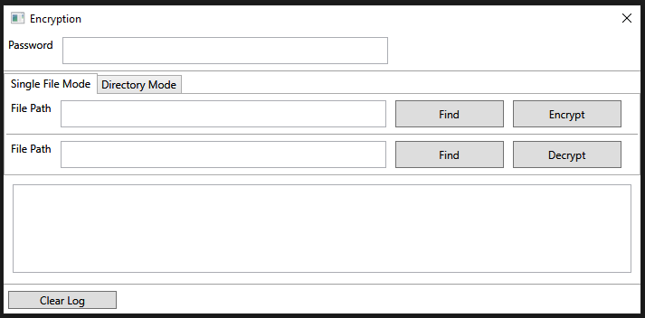

# File Encryption

A basic file and directory encryption and decryption app written in C# using WPF.

## Features

- Encrypt and decrypt individual files or entire directories
- Simple password-based encryption using AES-256
- Easy-to-use graphical interface

## Usage

1. Enter a password to use for encrypting or decrypting files.
2. Use the Find button to select a file to encrypt or decrypt. Alternatively, switch to the Directory Mode tab to perform the encrpytion/decrpytion operation on every file contained within the chosen directory.
3. Click either the Encrypt or Decrypt button to perform the operation.

## Screenshot

## Installation

Build and run using Visual Studio 2022 (or later).  
